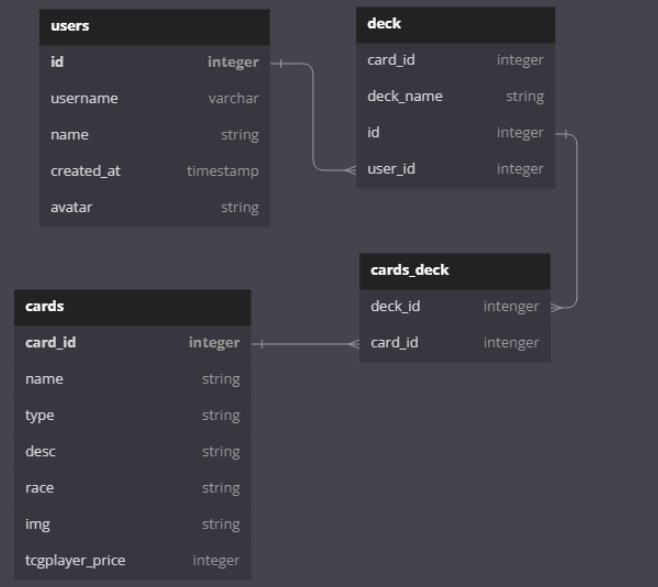

# Yu-Gi-Oh!Deck Builder

## App Description
Users will be able to track their personal Yu-Gi-Oh card collection and will be able to creat a deck online.

## Wireframe

## API Routes
| API Route  	| Request Method 	| Body                                                            	| Response                                                            	|
|------------	|-------------------	|-----------------------------------------------------------------	|---------------------------------------------------------------------	|
| /gallery  	| POST              	| {id, title, description, img, tcgplayer_price, set_name}          | {id, title, description, img, tcgplayer_price, set_name}              |
| /gallery      | GET               	| {id, title, description, img, tcgplayer_price, set_name}          | {id, title, description, img, tcgplayer_price, set_name}             	|
| /deckbuilder  | GET                	| {id, title, description, type, } 	                                | {id, title, description, deck_id}                                   	|
| /deckbuilder  | POST              	| {id, title, description, type, } 	                                | {id, title, description, deck_id}                                   	|
| /deckbuilder  | PATCH              	| {id, title, description, type, } 	                                | {id, title, description, deck_id}                                   	|
| /deckbuilder  | DELETE                | {id, deck_id } 	                                                | {id, deck_id}                                                       	|
| /login 	    | GET                	| {username, name}                                                 	| {username, name}                                                  	|
| /profile/:id 	| Patch             	|                                                                  	| {name}                                                              	|

## Client Side Routes
| API Route           	| Component        	|
|---------------------	|------------------	|
| /                     | Login.js          |
| /home                	| Home.js         	|
| /deckbuilder         	| Deckbuilder.js   	|
| /profile          	| Profile.js       	|
| /gallery          	| Gallery.js        |

## React Tree

## Schema

## Trello
